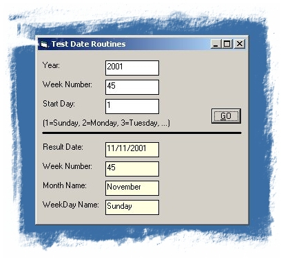



## Date Routines

### Description

Included are 6 date routines: FindEOCM (Find last day of the month), FindEOPM (Find last day of previous month), WeekNumber (Date to week number), WeekNum2Date (Week number to date), GetMonthNames (uses Locale names - Short or long description), GetWeekDayNames (uses Locale names - Short or long description). Test program is also included.
 
### More Info
 

             |
---                |---
**Submitted On**   |2001-11-09 23:32:42
**By**             |[Slider](https://github.com/Planet-Source-Code/PSCIndex/blob/master/ByAuthor/slider.md)
**Level**          |Beginner
**User Rating**    |5.0 (20 globes from 4 users)
**Compatibility**  |VB 4\.0 \(32\-bit\), VB 5\.0, VB 6\.0
**Category**       |[Math/ Dates](https://github.com/Planet-Source-Code/PSCIndex/blob/master/ByCategory/math-dates__1-37.md)
**World**          |[Visual Basic](https://github.com/Planet-Source-Code/PSCIndex/blob/master/ByWorld/visual-basic.md)
**Archive File**   |[Date\_Routi3434211102001\.zip](https://github.com/Planet-Source-Code/slider-date-routines__1-28788/archive/master.zip)

